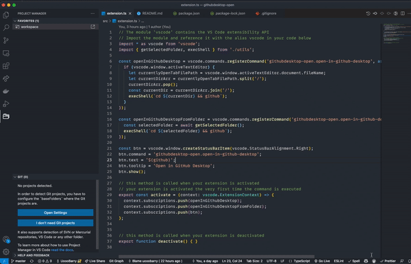
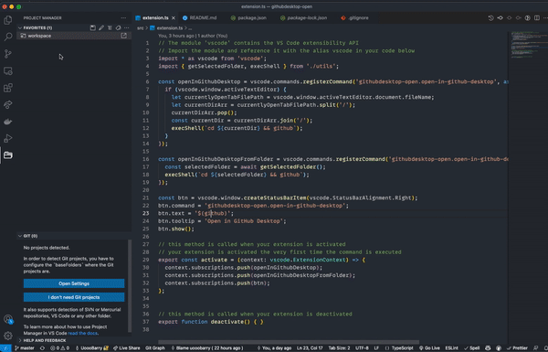
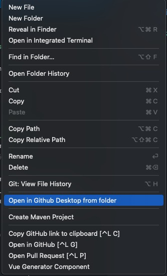

# README

A simple extension for opening current workspace in GitHub desktop. 

Install from [Vscode Marketplace](https://marketplace.visualstudio.com/items?itemName=UoooBarry.githubdesktop-open)

## Before use

Please install [GitHub Desktop](https://desktop.github.com/). Also install command line tools from the app.

## Usage

When finished editing, click the  icon from status bar to open current workspace in GitHub Desktop.

Or right click on explore folder and select `Open in Github Desktop from folder` from the context menu.

